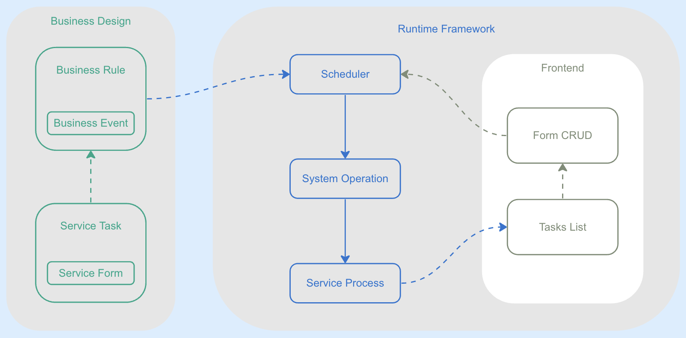

## HSSC(Healthcare Service Supply Chain) | [English](../README.md)

### 🚀 特性
#### 本项目是健康管理应用定制系统组成部分——运行时框架子系统

* 健康管理应用的目标是协同，把正确的信息在正确的时间点推送到正确的人面前。

* 为满足医疗保健行业的独特需求，需要由业务设计人员定制服务任务和业务规则，系统把业务设计马上生成业务应用发布运行。

* 这个由业务设计人员定制的应用可以根据预设的业务规则协同多位健康照护专家的服务任务，完成用户服务任务。

* HSSC运行时框架子系统导入设计子系统生成的业务系统脚本，migration后，即可发布运行，整个过程可以在10分钟内完成。

* 服务任务会按照业务管理人员定义的业务规则在正确的时间点被推送到每位健康照护专家的工作台上的任务清单里，以实现高效的团队协作。

* 参考设计子系统：https://github.com/jinniudashu/formdesign

### 🧠 核心概念
核心业务模型由七个关键元素构成，这是一个通用的协作系统抽象：
1. 服务任务：用服务任务的元信息，管理属性，业务属性来定义。
2. 服务表单：服务任务的工作成果，由多个业务字段的键值对组成的JSON表单来表示。
3. 业务事件：当服务表单中的业务字段值满足某种条件时（对应一个逻辑表达式），认为发生了某种业务事件。
4. 服务规则：完成服务任务后，如果发生某个业务事件时，应该采取什么行动（系统作业）。
5. 系统作业：系统调度动作，用于维护服务进程状态或发送消息。目前有四个调度动作：生成下一个任务；推荐下一个任务；发送微信公众号消息；发送企业微信消息。
6. 服务进程：服务任务运行时，用于管理调度服务任务状态。
7. 调度器：在服务进程状态变化时，根据业务规则判断要做出哪个系统调度动作



### 安装使用
#### 📋 Requirements
* Redis server is required at "localhost:6379" to run the application. Please install Redis server first.
* .env file is required at the root directory of the project, please refer to .env.example for the required environment variables.

#### 🛠️ Manual Installation
1. Clone the code repository to your local machine:
```bash
    git clone https://github.com/your_username/hssc.git
```
2. Navigate to the project directory:
```bash
    cd hssc
```
3. Create a virtual environment:
```bash
    python -m venv env
    source env/bin/activate  # Linux or macOS
    .\env\Scripts\activate  # Windows
```
4. Install the dependencies:
```bash
    pip install -r requirements.txt
```
5. Perform database migration:
```bash
    python manage.py migrate
```
6. Create a superuser account:
```bash
    python manage.py createsuperuser
```
7. Load initial data & test data:
```bash
    python manage.py loaddata initial_data.json
    python manage.py init_core_data
```
8. Run Celery beat and worker in defirent terminal, this required a Redis server running in background:
```bash
    python celery -A hssc beat -l info
    python celery -A hssc worker -l info
```
9. Run the development server:
```bash
    python manage.py runserver
```
10. Open http://127.0.0.1:8000/admin in your browser to check if the application has started correctly.

11. Register a test user account at http://127.0.0.1:8000/accounts/register. Any of the service tasks is trigered by the test user's action, no user no task.

12. Choose a test operater from ./core/management/commands/test_data_clinic.json, or create a staff in admin, then login at http://127.0.0.1:8000/clinic, you will see the task list.

Congratulations! You have successfully installed and run the HSSC application.

#### 🔧 Usage
1. Import design from design subsystem:
```bash
    python manage.py import_design
    python manage.py makemigrations
    python manage.py migrate
    python manage.py createsuperuser
    python manage.py loaddata initial_data.json
    python manage.py init_core_data
```